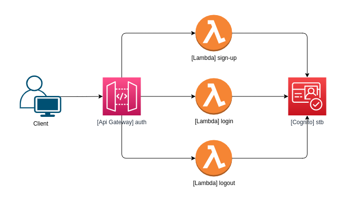

# STB: Authentication App

[](#)

Application responsible for providing security for the APIs of the STB project.



Features:
- sign up
- login
- logout


## Requirements

[](https://www.docker.com/)


## Installation

(IN PROGRESS)

```bash
$ docker-compose up --build
```


## Run Locally
```bash
$ sam local start-api
$ curl http://localhost:3000/
```


## Usage

(IN PROGRESS)

```bash
# sign up
$ curl -X POST http://localhost/signup

# sign up
$ curl -X POST http://localhost/login
```


## Running Tests

(IN PROGRESS)

```bash
$ pytest --cov=app tests/
```


## Tech Stack

[](https://www.docker.com/)
[](https://www.python.org/)
[](https://aws.amazon.com/)


## Reference
- https://aws.amazon.com/blogs/compute/using-github-actions-to-deploy-serverless-applications/
- https://docs.aws.amazon.com/serverless-application-model/latest/developerguide/sam-resource-api.html
- https://docs.aws.amazon.com/serverless-application-model/latest/developerguide/sam-resource-function.html


## Feedback

If you have any feedback, please contact me at raphaeldias.ti@gmail.com

[](https://github.com/raphaelbh)
[](https://www.linkedin.com/in/raphaelbh/)